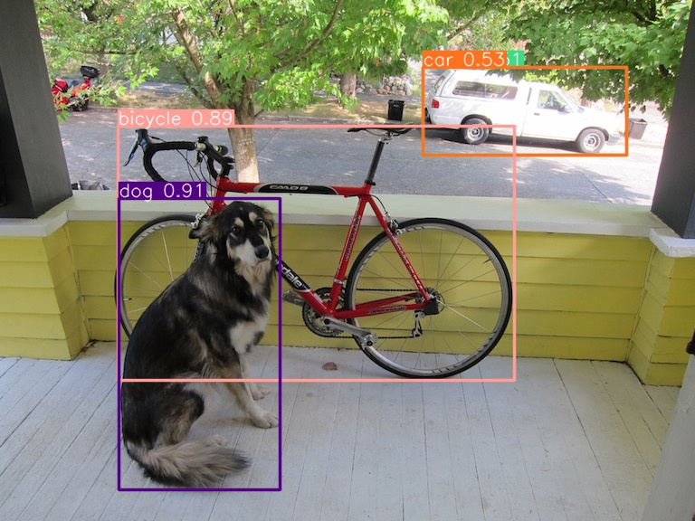

# YOLO Model Inference with Docker
A repository for showcasing a way to inference an object detection model (YOLO) using docker containerization technique.


## Detection Result Example



## Inferencing YOLO

### Run the inference
The simple code for inferencing a Yolov8n model:

```
from ultralytics import YOLO
from utility import ShowResult

# Load a model
model = YOLO('./model/yolov8n.pt')  # pretrained YOLOv8n model

# Image file name
fileName = './data/dog.jpg'

# Run batched inference on a list of images
results = model(fileName)  # return a list of Results objects

# Process results list
index = 0
for result in results:
  ShowResult(result, index)
  index += 1
```

### Utility
Additional method:
```
# Functionize the show result method
def ShowResult(result, index: int):
    boxes = result.boxes  # Boxes object for bounding box outputs
    masks = result.masks  # Masks object for segmentation masks outputs
    keypoints = result.keypoints  # Keypoints object for pose outputs
    probs = result.probs  # Probs object for classification outputs
    result.show()  # display to screen
    result.save(filename=f'./result/result_{index}.jpg')  # save to disk
```


## Docker Related Explainations

### Briefly About Docker
Three basic components of docker:
```Dockerfile``` -> ```Image``` -> ```Container```

```Dockerfile```: Contains a blueprint of an image.

```Image```: An immutable snapshot that includes everything needed to run a container.

```Container```:  A lightweight and executable runtime instance of an image.

Before run the next few steps, make sure docker has successfully installed in your machine.

Nb: I used Docker Desktop for Windows.

### Create a Dockerfile

Create a ```Dockerfile``` file in the directory, and fill with the following code. 

```
# Use a base image with Python 3.10.14 and necessary dependencies
FROM python:3.10.14-slim-bookworm

# Set the working directory in the container
WORKDIR /app

# Install system dependencies
RUN apt-get update && \
    apt-get install -y libgl1-mesa-glx libglib2.0-0

# Copy the local code to the container
COPY . /app

# Install Ultralytics dependencies
RUN pip install --no-cache-dir ultralytics

# Command to run the application
CMD ["python", "main.py"]
```

### Build a Dockerfile into an Image
Build a docker image from a Dockerfile could be done with the following command.

``` docker build -t yolo-app .```

Notes:

```-t yolo-app``` is the resulting image name and ``` .``` indicates the build context, which is the directory containing the Dockerfile and any files needed during the build process. In this example, the Dockerfile is assumed to be in the current directory.

### Run an Image as a Container
Can do with the following command:
``` docker run --rm -v .:/app yolo-app```

*Later, when the machine has already GPU setup and the GPU support image, the following command can be used to run docker using gpus:
``` docker run --rm --gpus all -v .:/app yolo-app```

Notes:

```-rm```: Remove the container once the code has been run.

```--gpus all```: State to run the code on all available GPU(s) in our machine.

```-v .:/app```: This flag mounts the current directory (where the docker run command is executed) to the ```/app``` directory inside the container. 

```yolo-app```: The docker image name that will be run as a container.

```--gpus all```: The code will be run on ```all``` available gpus(s).


## Test the Solution
- Functionality Testing: Run the inference process using different input images and verify that the YOLO model detects objects accurately. Check if the detected objects match the ground truth annotations.
- Performance Testing: Measure the inference time of the YOLO model within the Docker container. Compare the performance metrics (such as inference speed) against running the model outside of Docker to ensure that Dockerization does not significantly impact performance.
- Resource Utilization Testing: Monitor the resource utilization (CPU, GPU, memory) of the Docker container during inference. Ensure that the container efficiently utilizes available resources and does not exceed resource limits
- Logging and Monitoring: Monitor the Docker container's logs and metrics to track its behavior during inference. Use logging and monitoring tools to detect errors, troubleshoot issues, and optimize performance.


## Next Step to Optimize the Solution
- Performance Optimization: Analyze the performance metrics gathered during testing and identify bottlenecks in the inference process. Optimize the YOLO model, code, and Docker configuration to improve inference speed and resource utilization.


## Install GPU in Docker

### GPU Installation
```
# Add NVIDIA package repositories 
curl -s -L https://nvidia.github.io/nvidia-docker/gpgkey | sudo apt-key add - 
distribution=$(lsb_release -cs)
curl -s -L https://nvidia.github.io/nvidia-docker/$distribution/nvidia-docker.list | sudo tee /etc/apt/sources.list.d/nvidia-docker.list

# Install NVIDIA Docker runtime
sudo apt-get update
sudo apt-get install -y nvidia-docker2

# Restart Docker service to apply changes
sudo systemctl restart docker
```

### Inferencing YOLO using Docker with GPU
- First option: pull the available image from Ultralytics.
```
# Pull the latest Ultralytics image from Docker Hub
sudo docker pull ultralytics/ultralytics:latest

# Run with all GPU(s)
sudo docker run -it --ipc=host --gpus all -v .:/app ultralytics/ultralytics:latest
```

- Second option: Create our own Dockerfile and use the appropriate base image to make GPU support available in our later container.


## Important Note
- ```docker system prune```: To delete chache, etc.